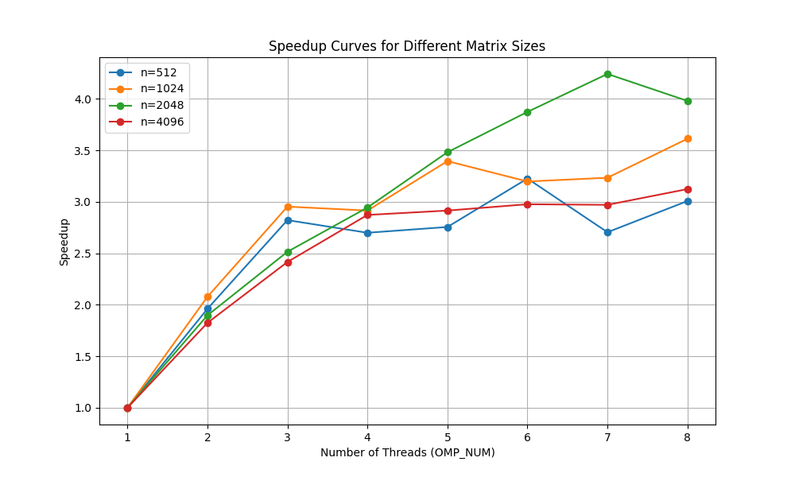

# TD1

`pandoc -s --toc README.md --css=./github-pandoc.css -o README.html`

## lscpu

*lscpu donne des infos utiles sur le processeur : nb core, taille de cache :*

```
Architecture:             x86_64
  CPU op-mode(s):         32-bit, 64-bit
CPU(s):                   16
Vendor ID:                AuthenticAMD
  Model name:             AMD Ryzen 7 5700G with Radeon Graphics
  Thread(s) per core:     2
  Core(s) per socket:     8
Caches (sum of all):      
  L1d:                    256 KiB (8 instances)
  L1i:                    256 KiB (8 instances)
  L2:                     4 MiB (8 instances)
  L3:                     16 MiB (1 instance)
```


## Produit matrice-matrice

### Effet de la taille de la matrice

  n            | MFlops
---------------|--------
1024 (origine) | 175.171
1023           | 842.509
1025           | 879.537
               |
               |

*Expliquer les résultats.*

Quand on utilise une puissance de deux, on risque d'avoir plus de cache misses une fois que le cache est aligné avec la taille de notre tableau.

### Permutation des boucles

*Expliquer comment est compilé le code (ligne de make ou de gcc) : on aura besoin de savoir l'optim, les paramètres, etc. Par exemple :*

La compilation suit trois étapes, chacune compilant des fichiers. La première compile Matrix.o à partir de Matrix.cpp, la deuxième compile ProdMatMat.o, et enfin, on compile TestProductMatrix.exe en effectuant l'édition de liens avec les deux fichiers déjà compilés.
Chaque fichier utilise quelques options de compilation :
- Wall pour afficher tous les avertissements,
- O3 et -O2 pour optimiser la compilation et appliquer des techniques comme l'élimination de code mort (dead code elimination) à la compilation,
- l'inclusion de la bibliothèque OpenMP avec -fopenmp.

`make TestProduct.exe && ./TestProduct.exe 1024`


ordre           | time(n=1024) | MFlops(n=1024) | time(n=2048) | MFlops(n=2048) |
----------------|--------------|----------------|------------|----------------|
i,k,j (origine) | 12.2594      | 175.171        | 78.3279    | 219.333        |
j,i,k           | 4.99392      | 430.019        | 45.8338    | 374.829        |
i,j,k           | 5.936        | 361.773        | 50.0       | 343.0          |
k,i,j           | 12.2558      | 175.222        | 78.0       | 219.5          |
j,k,i           | 0.392697     | 5468.55        | 3.0        | 5734.0         |
k,j,i           | 0.435486     | 4931.24        | 3.5        | 4915.0         |


*Discuter les résultats.*
Lorsqu'on itère de manière à accéder successivement à des espaces mémoire déjà récupérés et facilement accessibles par le cache, on réduit le nombre de cache misses, ce qui permet au code de s'exécuter plus rapidement.


### OMP sur la meilleure boucle

`make TestProduct.exe && OMP_NUM_THREADS=8 ./TestProduct.exe 1024`

  OMP_NUM         | MFlops(n=512)  | MFlops(n=1024) | MFlops(n=2048) | MFlops(n=4096)
------------------|----------------|----------------|----------------|---------------
1                 | 5265.9         | 4968.36        | 4434.46        | 4506.01
2                 | 10327.7        | 10322.9        | 8415.52        | 8222.67
3                 | 14865.8        | 14677.2        | 11155.3        | 10888.2
4                 | 14219.1        | 14486.3        | 13060.7        | 12947.5
5                 | 14514.8        | 16872.3        | 15441.9        | 13138.4
6                 | 16991          | 15889.3        | 17179.6        | 13415.7
7                 | 14247          | 16070.4        | 18814.1        | 13389.1
8                 | 15842.9        | 17954.1        | 17651.2        | 14079

*Tracer les courbes de speedup (pour chaque valeur de n), discuter les résultats.*
Les performances augmentent avec OMP_NUM, mais pas toujours linéairement. Pour n = 512, les performances stagnent après OMP_NUM = 6, probablement à cause de la surcharge de gestion des threads et de la contention du cache. Pour n = 2048 et n = 4096, l'évolution est plus progressive, indiquant une meilleure efficacité de la parallélisation sur des matrices plus grandes.


### Produit par blocs

`make TestProduct.exe && ./TestProduct.exe 1024`

  szBlock         | MFlops(n=512)  | MFlops(n=1024) | MFlops(n=2048) | MFlops(n=4096)
------------------|----------------|----------------|----------------|---------------
origine (=max)    | 5265.9         | 3980.95        | 3717.91        | 3910.36
32                | 9989.61        | 14031.3        | 6987.29        | 3934.86
64                | 7683.91        | 13525.3        | 6418.89        | 4046.77
128               | 8485.61        | 11474.6        | 7140.02        | 5174.03
256               | 5985.11        | 10083.8        | 10149.1        | 6328.95
512               | 3612.09        | 7734.62        | 8902.84        | 8740.43
1024              | X              | 3980.95        | 6015.82        | 8970.8

*Discuter les résultats.*
Les performances varient en fonction de szBlock. Pour n = 512, un bloc de taille 32 maximise les MFlops, mais pour n = 1024 et n = 2048, la meilleure performance est obtenue avec szBlock = 128 ou 256. Pour n = 4096, les performances augmentent avec szBlock, atteignant un maximum à szBlock = 1024. Cela suggère que les petites matrices bénéficient d'un blocage fin, tandis que les grandes matrices tirent parti de blocs plus grands pour une meilleure localité mémoire.


### Bloc + OMP


  szBlock      | OMP_NUM | MFlops(n=512)  | MFlops(n=1024) | MFlops(n=2048) | MFlops(n=4096)
---------------|---------|----------------|----------------|----------------|---------------
1024           |  1      | X              | 3980.95        | 6015.82        | 8970.8        
1024           |  8      | X              | 13616.5        | 15538          | 13770.5       
512            |  1      | 3987.64        | 3740.37        | 3035.49        | 2527.98       
512            |  8      | 10862.8        | 11210.9        | 13304.6        | 12971.9       

*Discuter les résultats.*
L'ajout de l'OMP améliore significativement les performances. Pour szBlock = 1024, passer de OMP_NUM = 1 à OMP_NUM = 8 multiplie presque par 3 les MFlops, montrant une bonne scalabilité. Avec szBlock = 512, l'amélioration est également notable, mais les performances restent inférieures à celles de szBlock = 1024 pour n = 2048 et n = 4096. Cela suggère que de grandes tailles de blocs couplées à un parallélisme élevé optimisent mieux l'utilisation du cache et la charge des threads.

### Comparaison avec BLAS, Eigen et numpy

#### BLAS (ProdMatMatBLAS.cpp)
`Time taken: 0.0638655 seconds`

#### Eigen
`Time taken: 0.0135848 seconds`

#### Numpy
```py
import numpy as np
import time

dim = 512
A = np.random.rand(dim, dim)
B = np.random.rand(dim, dim)

start_time = time.time()
C = np.dot(A, B)
end_time = time.time()

print("Matrix multiplication using NumPy completed.")
print(f"Time taken: {end_time - start_time} seconds")
```
`Time taken: 0.036458492279052734 seconds`

# Tips

```
	env
	OMP_NUM_THREADS=4 ./produitMatriceMatrice.exe
```

```
    $ for i in $(seq 1 4); do elap=$(OMP_NUM_THREADS=$i ./TestProductOmp.exe|grep "Temps CPU"|cut -d " " -f 7); echo -e "$i\t$elap"; done > timers.out
```
